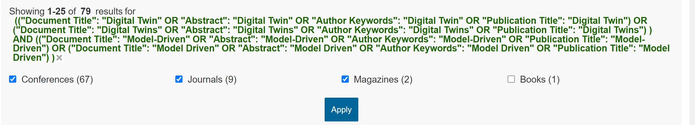
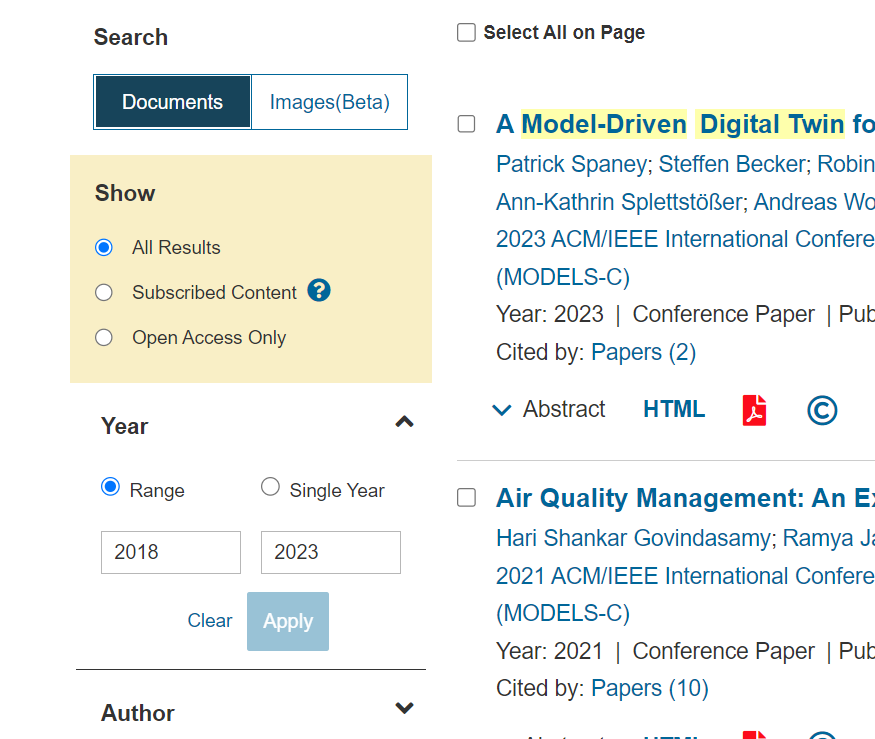
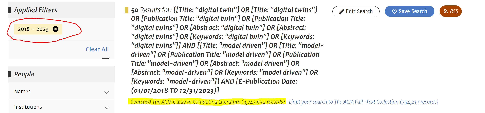

# IEEE Xplore

72 Search Results by performing the following procedure on April 3rd 2024:

1. Go to https://ieeexplore.ieee.org/Xplore/home.jsp
2. Enter the following String in the search field and press enter:
```
(("Document Title": "Digital Twin" OR "Abstract": "Digital Twin" OR "Author Keywords": "Digital Twin" OR "Publication Title": "Digital Twin") 
OR
("Document Title": "Digital Twins" OR "Abstract": "Digital Twins" OR "Author Keywords": "Digital Twins" OR "Publication Title": "Digital Twins") 
)
AND
(("Document Title": "Model-Driven" OR "Abstract": "Model-Driven" OR "Author Keywords": "Model-Driven" OR "Publication Title": "Model-Driven") 
OR
("Document Title": "Model Driven" OR "Abstract": "Model Driven" OR "Author Keywords": "Model Driven" OR "Publication Title": "Model Driven") )
```
3. In the following window, select "Conferences, Journals, Magazines" and click "Apply"

4. In the left menu bar, select the "Range" option in the "Year" area and enter "empty" to "2023" as range (the website will automatically replace the empty value with "2018"). Also select search for "Documents" and "Show All Results" perform no other selections in this menubar.


# ACM
26 Search Results by performing the following procedure on April 3rd 2024

1. Go to https://dl.acm.org/search/advanced
2. Select "The ACM Full-Text Collection as Database
3. Enter the following String in the textfield to the left of "Anywhere" in the "Search Within" field:
```
(
Title:("digital twin" OR "digital twins") 
OR ContentGroupTitle:("digital twin" OR "digital twins") 
OR Abstract: ("digital twin" OR "digital twins")
OR Keyword:("digital twin" OR "digital twins")
)
AND
(
Title:("model driven" OR "model-driven") 
OR ContentGroupTitle:("model driven" OR "model-driven") 
OR Abstract:("model driven" OR "model-driven") 
OR Keyword:("model driven" OR "model-driven")
)
```
4. In the "Publication Date" area, select "Custom Range" and for the "To" date, select "Dec" as month and "2023" as year.

**The following screenshot shows the final configuration:**



# Web of Science
*Note: the selected databases for web of science are based on the subscription of the author's universities.*

119 Search Results by performing the following procedure on April 3rd 2024: 
1. go to https://www.webofscience.com/wos/woscc/advanced-search
2. login if required
3. Select "All Databases" for the "Search in" option and "All" for the "Collections" option. Based on the subscriptions of the authors' universities, this includes the following databases: Web of Science Core Collection, Grants Index, KCI-Korean Journal Database, MEDLINE, Preprint Citation Index, ProQuest Dissertations & Theses Citation Index, SciELO Citation Index

4. In the textfield that says "Enter or edit your query here.", enter the following string:
```
(
    (TS=("Digital Twin") OR TI=("Digital Twin") OR SO=("Digital Twin") OR AB=("Digital Twin") OR CF=("Digital Twin") OR AK=("Digital Twin"))
    OR
    (TS=("Digital Twins") OR TI=("Digital Twins") OR SO=("Digital Twins") OR AB=("Digital Twins") OR CF=("Digital Twins") OR AK=("Digital Twins"))
)AND (
    (TS=("Model Driven") OR TI=("Model Driven") OR SO=("Model Driven") OR AB=("Model Driven") OR CF=("Model Driven") OR AK=("Model Driven"))
    OR
    (TS=("Model-Driven") OR TI=("Model-Driven") OR SO=("Model-Driven") OR AB=("Model-Driven") OR CF=("Model-Driven") OR AK=("Model-Driven"))
)
```
5. Click the "Add Date Range" option, and select "Custom" in the "Publication Date" dropdown.
6. Enter 1900-01-01 and 2023-12-31 as date range.

**The following screenshot shows the final configuration:**


# Scopus
181 Search Results by performing the following procedure on April 3rd 2024: 
1. Go tohttps://www.scopus.com/search/form.uri?display=advanced
2. Enter the following String in the "Enter Search String" field:
```
( SRCTITLE ( "Digital Twin" ) OR TITLE-ABS-KEY ( "Digital Twin" ) OR SRCTITLE ( "Digital Twins" ) OR TITLE-ABS-KEY ( "Digital Twins" ) ) 
AND ( SRCTITLE ( "Model Driven" ) OR TITLE-ABS-KEY ( "Model Driven" ) OR SRCTITLE ( Model-Driven ) OR TITLE-ABS-KEY ( Model-Driven ) ) 
AND PUBYEAR < 2024
```
